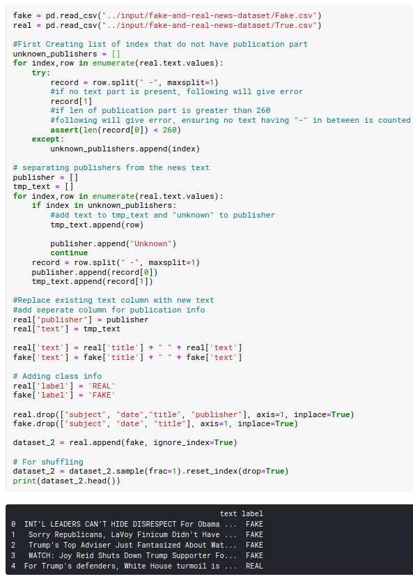
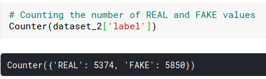

# Fake News Classification
Finally my project is done! This time I decided to work on Fake News Classification!
I approached this project as more of a research; gathering as many datasets as possible, seeing what people tried with them, then doing my own tweakings and conclusions.

The reason for that is that as you might have expected or already known, this is no easy thing to predict, not at all.

I believe it gives one a clearer vision/understanding of the tools used especially with Natural Language Processing.
That there exists complex problems that still require a lot of work and cooperation between specialists from different fields in order to understand better(as will be shown below).
## [My LinkedIn](https://linkedin.com/in/mohamed-ilyes-ltifi)

Enjoy!

[Introduction](#introduction)

[Tools already built](#tools-already-built)

[Sources of inspiration](#sources-of-inspiration)

[Datasets](#datasets)

[Data analysis and cleaning](#data-analysis-and-cleaning)
- [Analysis of Dataset 1](#analysis-of-dataset-1)
- [Analysis of Dataset 2](#analysis-of-dataset-2)

[Algorithms used](#algorithms-used)

[Prediction results](#prediction-results)
- [Results of Dataset 1](#results-of-dataset-1)
- [Results of Dataset 2](#results-of-dataset-2)

[Conclusions](#conclusions)

## Introduction
Classifying news as real/fake is equally very important and very hard.
- Take Elections for example(the first dataset is based on the 2016 American Presidential period). Very large numbers of news both fake and real hit the internet resulting in a wide spread of false information(thanks to social medias) in a very critical time for any country.
Also as you might remember, the first 3 months of the internation Covid-19 situation saw many false information/theories which may had disastrous consequences.
The good thing is, this provided good amounts of data to analyze and understand.

- As for the hardness, it is mainly because 'fake' has many different meanings and forms. As explained in the firstdraftnews article(see Sources of inspiration), there are actually 7 levels of different danger. Among which are:
    - Satire: No intention to harm, but has potential to fool
    - ...
    - False Connection: When headlines, visuals or captions don’t support the content(a.k.a. clickbait)
    - ...
    - Fabricated content: New content that is 100% false and designed to deceive and harm

And so, as the miguelmalvarez article(see Sources of inspiration) explains, Divide & Conquer must be used in order to tackle this multi-form problem. It divided it into: Fact Checking, Source credibility and Trust, News bias and Misleading headlines. They are well detailed there.

The thing that everyone agrees about is that Journalists must cooperate with AI experts to make real advancement in this matter.
But for now, let's see how our regular algorithms perform !

## Tools already built
- [The Fake News Data Science challenge](http://www.fakenewschallenge.org)
- [FullFact](https://fullfact.org/)
- [Article about CrossCheck](https://firstdraftnews.org/latest/crosscheck-launches/)
- [Article about Facebook's Fake News AI](https://techcrunch.com/2016/11/14/facebook-fake-news/)
- [A web app with a model built inside to predict fake news(belongs to the guy that wrote the last article in Sources of inspiration)](http://real-fake-news-classifier.herokuapp.com/)

## Sources of inspiration
- https://www.kaggle.com/ayushimishra2809/fake-news-prediction
- https://miguelmalvarez.com/2017/03/23/how-can-machine-learning-and-ai-help-solving-the-fake-news-problem/
- https://www.datacamp.com/community/tutorials/scikit-learn-fake-news
- https://opendatascience.com/how-to-build-a-fake-news-classification-model/
- https://towardsdatascience.com/building-and-deploying-end-to-end-fake-news-classifier-caebe45bd30

## Datasets
1) https://www.kaggle.com/hassanamin/textdb3 : News articles from the 2016 American Presidential Campaign

2) https://www.kaggle.com/clmentbisaillon/fake-and-real-news-dataset : Already divided into real.csv and fake.csv

## Data analysis and cleaning

All datasets will be converted to one single format, to ease the implementation.
The format will contain 2 columns: 'text' + 'label'(REAL or FAKE)

#### Analysis of Dataset 1:
The 'title' will be appended to the 'text' and so the 'title' column will be dropped.
It contains 6335 rows of news from the 2016 American Presidential period.

Analysis:

#### Analysis of Dataset 2:
Same thing with the 'title' column, and the 'subject' and 'date' columns will be dropped. Finally the fake.csv and real.csv will be merged and we'll add the 'label' column and fill it with FAKE or REAL.
It is mostly US News from the end 2017, having 44898 rows ~= x7 the size of the first dataset.

Analysis:

## Algorithms used

Vectorizers:
- Count Vectorizer
- Hashing Vectorizer
- Tfidf Vectorizer

Classifiers:
- Multinomial Naive Bayes 
- Gaussian Naive Bayes
- Logistic Regression
- Passive Aggressive Classifier
- Decision Tree Classifier
- Random Forest Classifier
- Support-Vector Clustering 

All algorithms and vectorizers are implemented in a smart and generic way.
That way we can couple Vectorizers and Algorithms and try all possible combinations!

The execute_algorithm() function takes in a dataset, a vectorizer and an algorithm. It applies the vectorizer to the dataset that tokenizes it and passes the vocabulary to the algorithm, which fits and predicts. Finally it returns the accuracy score and and the confusion Matrix.
75% of the data for every test was reserved for training.

Example:

## Prediction results
We'll be picking the best 5 out of the 21 scores for each dataset.

#### Results of Dataset 1:

Confusion matrix of the Passive Aggressive Classifer with the TfidfVectorizer:

#### Results of Dataset 2:

Confusion matrix of the Passive Aggressive Classifer with the TfidfVectorizer:

## Conclusions
It seems that after getting 94% and 97% accuracy in the 2 datasets, that our work is done.
But that's not really the case.
There is a great write-up on StackOverflow with this incredibly useful function for finding vectors that most affect labels(meaning what words are most important to our models)
It only works for binary classificaiton (classifiers with 2 classes) so it will work in our case since we only have 'FAKE' and 'REAL' labels.

Here is its implementation using our best classifier(PassiveAgressiveClassifier) coupled with the TfidfVectorizer:

The results are shockingly noisy, and although there is some reason in them, most of it don't mean good.
For example:
- The word 'said' being the realest word can be explained by the fact that most real news will contain direct quotings from politicians; it adds authenticity and is one of the easier ones to check.
- The same can probably be said to explain 'wednesday','tuesday','friday' and 'thursday' in the realest words list: they could have been used to bring up past events less than a week before the article was written.
- That was the 2nd dataset's lists, the first one was similar but had way more politicians names in the fakest words. Which mostly concerned personal attacks at the time of the elections against those politicians.

Finally, I am satisfied with the effort put into this but not quite with the results.
I have learned a lot about Natural Language Processing; what works best with it, what doesn't, what are the challenges etc..
But what I'm sure about is that more knowledge from other fields(journalists etc..) must be brought into this to shed more light on the obstacles and hopefully with more talk/competitions made on the subject, it will happen soon.

Thank you for reading !
